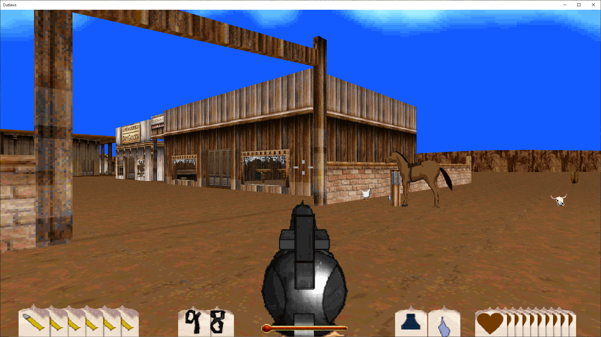
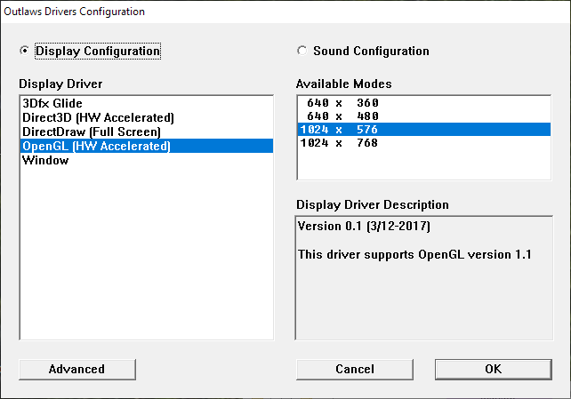

# Outlaws OpenGL Driver
This is a rasterization driver for Lucas Arts 1997 game "Outlaws". It adds OpenGL as a rendering option to the original game.



## Why?
It was a learning experience. I found it interesting that the developers of the original game built the rendering options as modules and it piqued my interest to see if I could make a new one. There are of course no source code publicly available for the original drivers that shipped with the game, so a lot of work went into reverse engineering the driver API.

The most interesting thing about the implementation is that it is actually a valid Outlaws rasterization driver. It does not perform any tricks to pretend to be a valid driver, it is not a wrapper over Glide or any other API. As such, it works with (and must be configured with) **olcfg.exe**.



## Bugs / Not implemented
- ~~Translucency and blending not implemented yet (water effects etc.)~~
- Tinting effects not implemented yet.
- Texture loading is still a bit of a mystery. There are situations where the texture cache gets corrupted and wrong textures are displayed on the wrong polygons. If you experience this after restarting a level or tabbing in/out of the game, you need to restart Outlaws.

## Installation and usage
- Compile and place **lecogl.dll** in your Outlaws game directory.
- Create a settings-file called legogl.conf and place it in the same directory as the DLL. Supported settings are:
```
; Window resolution
windowResolutionWidth 1920
windowResolutionHeight 1080
; Toggles fullscreen on/off. If 1 then the desktop resolution is used. Mouse cannot be used in game with fullscreen off :(
fullscreen 0
```
- Run **olcfg.exe**. Select the OpenGL driver in the list and a corresponding resolution to the right. 
The resolution should be choosen based on the aspect ratio of your intended output. The driver automatically upscales to your window resolution set in the settings file (or desktop resolution if fullscreen). Rendering of primitives is done in the resolution set in the config file, so this really only affects aspect ratio and text-resolution in game. The forced upscaling was chosen because Outlaws projects and clips in software. The game runs really slow if you were able to select a large resolution here.

## License
Licensed under the GPL version 3.

This is in no way affiliated with or endorsed by Activision, Lucas Arts or any other company.
